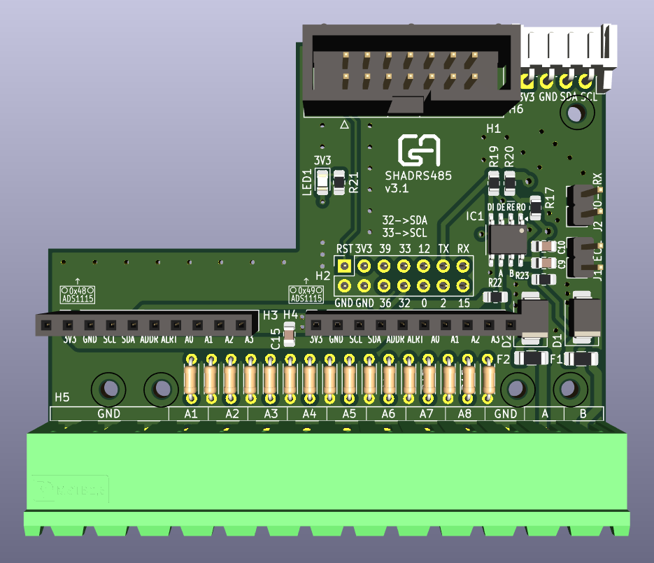

# SHIO88W

ESP32 based DIN rail mount IO board.

More [Pictures](/Pictures#assembled-boards) and [Video](https://youtu.be/fpFCvI0ayuA) of the assembled board and extensions.

Example [ESPHome configs](/ESPHome)

## Features

* 12V DC input for powering
* 8 open collector output (50 mA load per channel)
* 8 opto isolated input
* LEDs for output and input status
* 1 sensor input (ds18b20, dht)
* 14 pin IDC connector for direct GPIO access

View [3D model](https://3dviewer.net/#model=https://dl.dropbox.com/scl/fi/ps5aiib8u3sv6k7nb4t2t/SHIO88W.wrl?rlkey=a4zxlte14uyzpbyriw4eh9wyb&st=gwqd6p7e&dl=0)

## Extensions

### SHADRS485

Extension board mountable top of the SHIO88W board.

* Sockets and breakout for 2 ADS1115 AD converter
* On board voltage dividers for each channel
* RS-485 interface

View [3D model](https://3dviewer.net/#model=https://dl.dropbox.com/scl/fi/sx0bww4iqjbbnxwdh6ggv/SHADRS485.wrl?rlkey=c4fh2khc0jtckmeib4782orl5&st=69d7faog&dl=0)

### SHHMI

Control interface for SHIO88W.

* PCB for 128x64 OLED display and control buttons. Fits the 0.96 and 1.3 inch OLED versions.
* Mountable top of the SHADRS485 board

View [3D model](https://3dviewer.net/#model=https://dl.dropbox.com/scl/fi/2z42lx2431tqztieb8168/SHHMI.wrl?rlkey=yz81izeonbwx9g51vw6o6f9bu&st=en7jitjy&dl=0)

